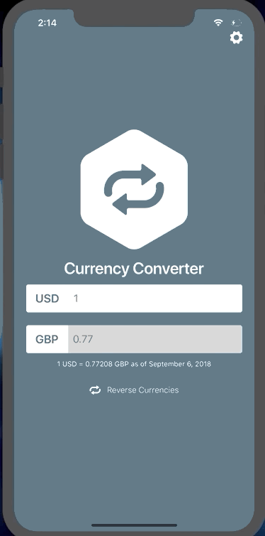
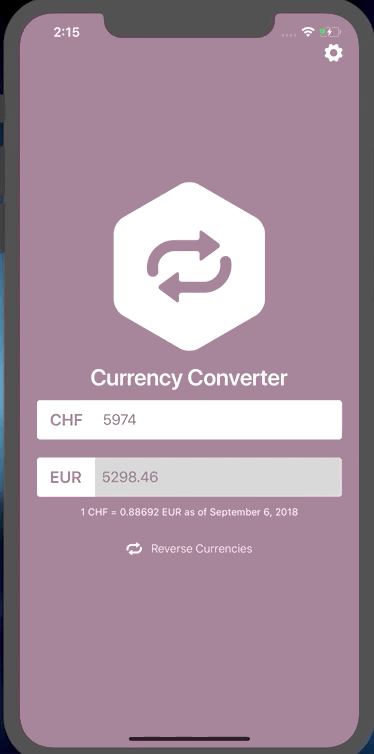

# Currency Converter App

> Currency Converter app, for both Android and iOS, built in React Native(Typescript and React Native, Redux-Saga).

### Screenshots

##### Converting


##### Currencies



##### Themes


##### About us



### Requirements

Ensure you have NodeJS and Yarn installed before you start the installation process.
To download NodeJS and Npm [click here](https://nodejs.org/en/download/). OR To install Node.js and Npm via package manager [click here](https://nodejs.org/en/download/package-manager/)

### Set-up Process

```
- Clone the repository to your computer ensure to run the command below in the directory you want to store the project.
    # git clone https://github.com/mcaleb808/currency-converter.git
```

#### Set-up Expo

- Run `yarn global add expo-cli` in the terminal to install the expo-cli globally.
- Install the Expo app in your iOS/Android phone (_`skip this step if you intend on using an emulator/simulator`_)
  - For android - [link](https://play.google.com/store/apps/details?id=host.exp.exponent)
  - For iPhone - [link](https://itunes.com/apps/exponent)

#### Emulator/Simulator

Ensure you have an emulator installed, the links below will help guide you through the set up.

- [Xcode](https://facebook.github.io/react-native/docs/getting-started#xcode)
- [Android](https://facebook.github.io/react-native/docs/getting-started#android-development-environment)

### Run in development

1. Run `yarn install` - To automatically install all dependencies.
2. Run `yarn start` - To run the project.
3. Scan the QR code the with the Expo app on your modile device or ensure that you're simulator/emulator is running, then press i or a to run the project on iOS or Android respectively.

   `Note:` For an iOS device open the phone camera app and scan the QR Code, you will then be prompted to open in expo, accept the prompt to start.

### Running tests

`yarn test`
